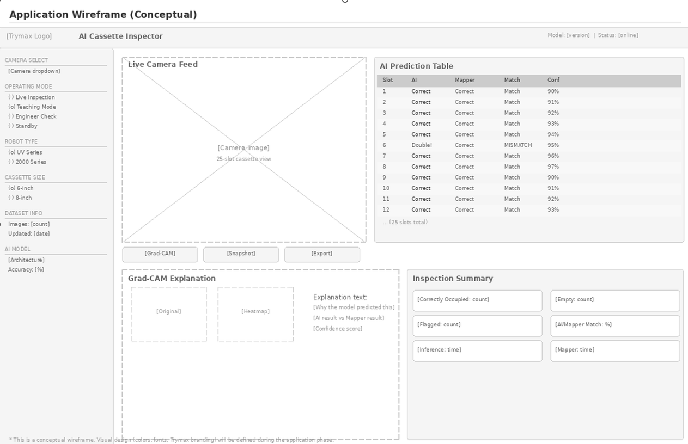

# Cassette Inspector

AI-powered semiconductor cassette inspection system built with PyTorch, FastAPI, and Grad-CAM.

Designed for use with Trymax UV and 2000 series wafer handling robots. A live camera feed is analysed in real time by a two-stage neural network that detects the cassette, classifies each of the 25 slots as occupied or empty, and flags mismatches against the robot mapper — all with visual explanations via Grad-CAM heatmaps.


---

## What it does

- Detects cassettes in a live camera feed using a fine-tuned YOLO26m model
- Classifies all 25 slots per cassette (occupied / empty) using a MobileNetV3 slot classifier
- Compares AI predictions against the Trymax mapper result and highlights mismatches
- Generates Grad-CAM heatmaps so engineers can see exactly why the model made each decision
- Exposes a REST API so Trymax NEO software can call it directly
- Runs fully in-browser, no installation required for end users

---

## Architecture

```
Camera → FastAPI backend → Cassette detector (YOLO26m)
                        → Slot classifier (YOLO26n-cls)
                        → Grad-CAM explainer
                        → REST API  (/predict, /explain, /snapshot, /status)
                        → Frontend (HTML/CSS/JS served by FastAPI)
```

The system follows a two-stage pipeline. The cassette detector first locates and crops the cassette from the full image. The slot classifier then runs on that crop only, which prevents false detections from background noise.

---

## Getting started

### Requirements

- Python 3.10 or higher
- CUDA-capable GPU recommended (runs on CPU but slowly)
- A webcam or IP camera

### Install

```bash
git clone https://github.com/AntonDesigns/cassette-inspector.git
cd cassette-inspector
pip install -e .
```

### Add model weights

Place your trained weights in the `models/` folder:

```
models/
  cassette_detector/
    best.pt       ← based off YOLO26m cassette detector
  slot_classifier/
    best.pt       ← based off YOLO26n-cls slot classifier
```

Model weights are not included in this repository. See [Training](#training) if you want to train your own, or contact the author for pre-trained weights.

### Run

```bash
cassetteai serve
```

Then open `http://localhost:8000` in your browser.

---

## API

The FastAPI backend exposes the following endpoints:

| Method | Endpoint | Description |
|--------|----------|-------------|
| POST | `/api/predict` | Run full inference on an image |
| POST | `/api/explain` | Generate Grad-CAM heatmap |
| POST | `/api/snapshot` | Capture and return a camera frame |
| GET | `/api/status` | Model and camera status |
| POST | `/api/confirm` | Engineer confirms or overrides a prediction |

Example response from `/api/predict`:

```json
{
  "slots": [1, 3, 3, 3, 3, 4, 3, 3, 3, 3, 3, 3, 3, 3, 3, 3, 3, 3, 3, 3, 3, 3, 3, 3, 3],
  "confidence": [0.97, 0.95, 0.98, 0.96, 0.94, 0.95, 0.97, 0.98, 0.96, 0.95,
                 0.97, 0.96, 0.95, 0.98, 0.94, 0.97, 0.96, 0.95, 0.98, 0.97,
                 0.96, 0.95, 0.97, 0.96, 0.98],
  "inference_ms": 380
}
```

---

## Training

Training notebooks and data pipeline live in a separate private repository. This repo contains only the application layer. If you want to train your own models:

1. Collect cassette images and label them using LabelImg (YOLO format for the detector, binary slot labels for the classifier)
2. Train the cassette detector using YOLO26m fine-tuning
3. Train the slot classifier using MobileNetV3 with transfer learning
4. Place the resulting `best.pt` files in `models/cassette_detector/` and `models/slot_classifier/`

---

## Project context

This application was built as part of a 20-week internship at Trymax Semiconductor Equipment B.V. The goal is to replace manual cassette inspection with a real-time AI system that integrates with existing robot software.

The project is structured in three stages:

- Stage 1: Cassette detector (locate and crop the cassette from a full image)
- Stage 2: Slot classifier (classify each of the 25 slots as occupied or empty)
- Stage 3: Anomaly detection (double-slotted wafers, cross-sided inserts, tilted wafers)

---

## Tech stack

- PyTorch + Ultralytics YOLO26 for object detection
- YOLO26n-CLS for slot classification
- Grad-CAM for explainability
- FastAPI for the backend and API
- OpenCV for camera handling
- Plain HTML/CSS/JavaScript for the frontend (no framework dependency)
- SQLite for inspection history

---

## License

MIT
